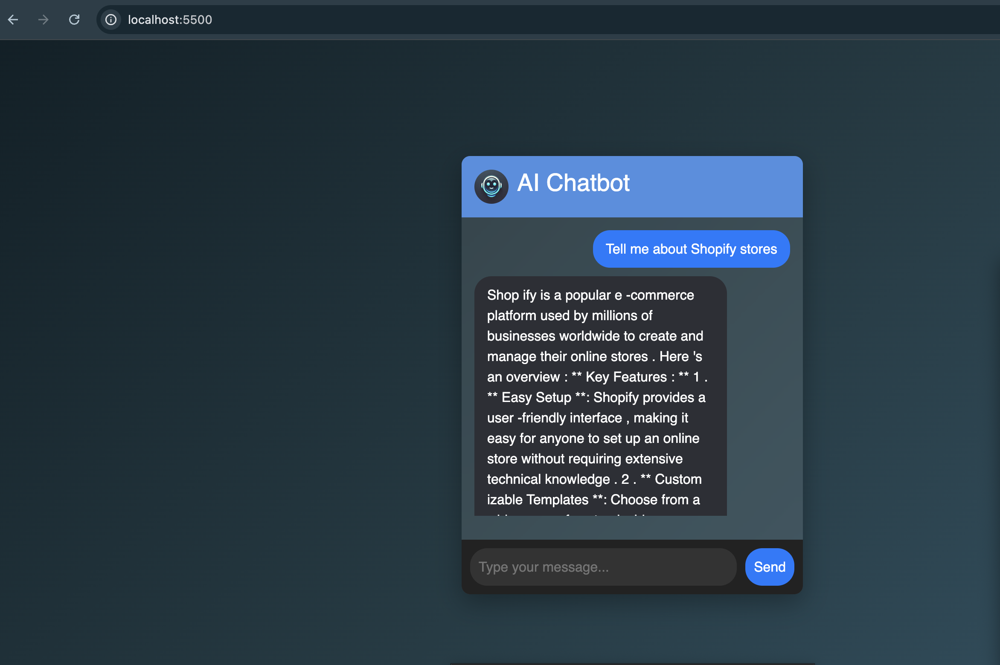

# **🚀 AI-Powered Smart Chatbot (FastAPI + LLaMA)**
  


### **📌 Description**
This project is an **AI-powered chatbot** built using **FastAPI and LLaMA 3.1** for generating **intelligent, context-aware responses**.  
It features **a modern UI**, WebSocket-based real-time messaging, and MongoDB for conversation logging.

---

## **📂 Project Structure**
```
chatbot_project/
│── backend/
│   ├── app/
│   │   ├── chatbot.py         # AI Response Logic (LLaMA API Integration)
│   │   ├── config.py          # Environment Variables (MongoDB, etc.)
│   │   ├── database.py        # MongoDB Connection & Schema
│   │   ├── main.py            # FastAPI App Setup
│   │   ├── models.py          # Data Models
│   │   ├── routes.py          # API Routes (WebSockets)
│   │   ├── utils.py           # Utility Functions
│   ├── .env                   # Environment Variables
│   ├── requirements.txt       # Required Python Packages
│   ├── README.md              # Project Documentation
│
│── frontend/
│   ├── assets/                # Icons, Images, and GIFs
│   ├── css/
│   │   ├── styles.css         # Chatbot Styling & Animations
│   ├── js/
│   │   ├── chatbot.js         # WebSocket & Chatbot Logic
│   ├── index.html             # Chatbot UI (Frontend)
│   ├── README.md              # Frontend Documentation
│
│── screenshots/               # Contains output screenshots
```

---

## **🛠️ How to Run Locally**
### **🔹 1️⃣ Setup MongoDB**
Make sure MongoDB is installed and running:  
```sh
mongod --dbpath /data/db
```
Or use **Docker**:
```sh
docker run -d -p 27017:27017 --name chatbot-mongo mongo
```

---

### **🔹 2️⃣ Run the Backend (FastAPI)**
1. **Navigate to backend directory**:
   ```sh
   cd backend
   ```
2. **Create virtual environment**:
   ```sh
   python -m venv venv
   source venv/bin/activate  # macOS/Linux
   venv\Scripts\activate     # Windows
   ```
3. **Install dependencies**:
   ```sh
   pip install -r requirements.txt
   ```
4. **Start FastAPI server**:
   ```sh
   uvicorn app.main:app --reload
   ```
   **FastAPI will run at:**  
   - API Docs: **http://localhost:8000/docs**  
   - WebSocket API: **ws://localhost:8000/ws**

---

### **🔹 3️⃣ Run the Frontend**
1. **Navigate to frontend directory**:
   ```sh
   cd frontend
   ```
2. **Start a local server**:
   ```sh
   python3 -m http.server 5500
   ```
3. **Open the chatbot in your browser**:
   ```
   http://localhost:5500
   ```

✅ **Now, you can chat with the AI in real-time!** 🎉

---

## **💡 Features Implemented**
### ✅ **1️⃣ FastAPI API with WebSocket Support**
- Built using **FastAPI**
- WebSockets for **real-time chat interaction**
- API Documentation available at **`/docs`**

### ✅ **2️⃣ AI-Powered Chatbot with LLaMA 3.1**
- **Integrates LLaMA 3.1** for **dynamic AI responses**
- Handles **context-aware** conversations

### ✅ **3️⃣ Conversation Logging System**
- Uses **MongoDB** to store **chat history**
- Logs **user queries & bot responses** with timestamps

### ✅ **4️⃣ Innovative Chatbot UI**
- **Modern, animated chatbot UI**
- **Emoji and GIF support** for better engagement
- **Typing indicator** to enhance realism

### ✅ **(Bonus) Context Awareness**
- **Understands previous messages** in a conversation
- Example:
  ```
  User: "Tell me about Shopify"
  User: "How does it handle payments?"
  Bot understands that "it" refers to Shopify.
  ```

### ✅ **(Bonus) Personalization**
- **Remembers user name & preferences**
- Saves previous **conversation history**

---

## **🎯 What This Project Covers**
✅ **FastAPI & WebSocket Integration**  
✅ **AI Model Integration with LLaMA 3.1**  
✅ **MongoDB Logging & Context Awareness**  
✅ **Advanced UI with Animations & Emojis**  

---

## **💬 Final Thoughts**
This chatbot showcases **real-time AI-powered conversation** with a **modern UI** and **intelligent responses**.  
💡 **Future Improvements**: Further improve response handling, add user authentication, and optimize performance.

🚀 **Enjoy using your smart AI chatbot!** 🧠💬🎨